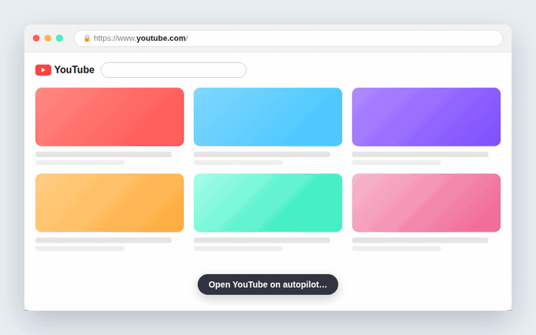

# YouTube Home Blocker — Redirect & Focus

A tiny Manifest V3 Chrome extension that redirects the YouTube homepage
(`https://www.youtube.com/`) to any URL you choose, so you skip the endless
recommendations feed. The rest of YouTube — search, video pages, subscriptions,
history — keeps working normally.

  

## Why

The YouTube homepage feed is the single biggest time sink on the site. This
extension removes it without breaking anything else: open `youtube.com` and you
land on your task list, calendar, a blank page — whatever you set.

## How it works

A content script runs at `document_start` on every YouTube page. **Only when the
path is exactly `/`** it calls `location.replace()` to your chosen URL. The early
injection redirects the feed before it renders; the exact-path guard makes sure
every other YouTube page is untouched. It also re-checks on YouTube's in-app
(`yt-navigate-finish`) navigation, so clicking the logo to go "home" is redirected
too — not just a fresh page load.

The toolbar popup has a one-click **on/off toggle** to pause redirecting when you
actually want the feed, and a small **counter** showing how many times it has
sent you back to focus.

Your redirect URL and the on/off state live in `chrome.storage.sync` (synced
across your browsers, never leaves them); the redirect counter lives in
`chrome.storage.local` to stay off the sync write quota.

## Install

**From the Chrome Web Store (recommended):**
[YouTube Home Blocker — Redirect & Focus](https://chromewebstore.google.com/detail/youtube-home-blocker-%E2%80%94-re/iicjmmpbljanedonobppjkndnhjdflgp)

## Install from source

1. Open `chrome://extensions`.
2. Enable **Developer mode** (top right).
3. Click **Load unpacked** and select this directory.
4. Click the extension icon, enter the URL you want, and press **Save**.

The default redirect is the Todoist Today view
(`https://app.todoist.com/app/today`) — change it any time from the popup.

## Project layout

| File           | Purpose                                                        |
| -------------- | ------------------------------------------------------------- |
| `manifest.json`| Extension manifest (MV3), permissions, icons.                 |
| `constants.js` | Shared default redirect URL, used by `content.js` and `popup.js`. |
| `content.js`   | Redirects the homepage. Injected at `document_start`.         |
| `popup.html`   | Toolbar popup UI.                                             |
| `popup.js`     | Loads/saves the redirect URL in `chrome.storage.sync`.        |
| `icons/`       | Toolbar and store icons (16/32/48/128).                       |

No build step, no dependencies — plain JS/HTML loaded directly by Chrome.

## License

MIT © [Iurii Rogulia](https://iurii.rogulia.fi)
